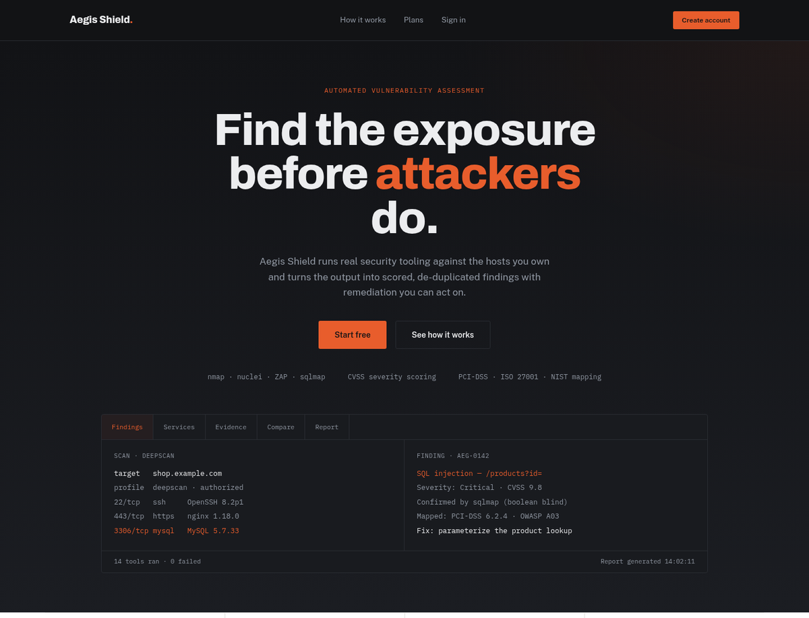
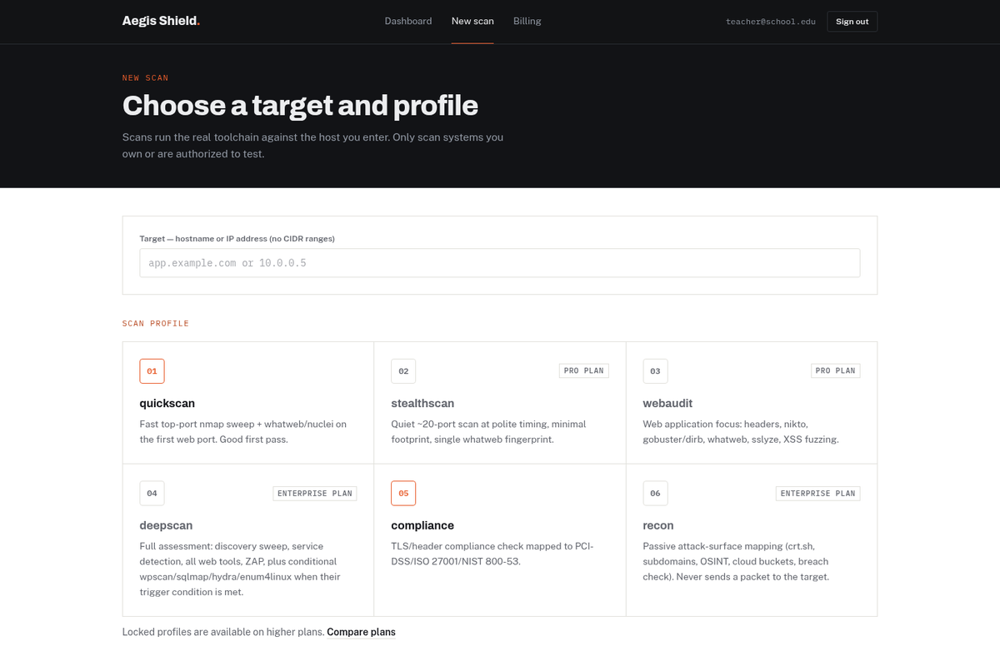

# Aegis Shield

**Aegis Shield** is a subscription-based web platform for automated vulnerability assessment. It puts
the [Aegis Scanner](../README.md) engine behind accounts, plans, an approval workflow and a web
interface. Users sign up, pick a scan profile, point it at a host they are authorized to test, and get
scored findings with remediation guidance and downloadable reports.



---

## Contents

| Document | What it covers |
|---|---|
| [Installation](docs/INSTALLATION.md) | One-click start on Windows/Linux, manual setup, PostgreSQL, Docker, configuration reference |
| [User guide](docs/USER_GUIDE.md) | Creating an account, running scans, reading results, exports, comparing scans, plans |
| [Administrator guide](docs/ADMIN_GUIDE.md) | Approving upgrades, managing users and reports, the audit log |
| [Architecture](docs/ARCHITECTURE.md) | Components, request flow, data model, how scans execute, design decisions |
| [API reference](docs/API_REFERENCE.md) | Every REST endpoint with auth requirements, request and response shapes |
| [Security](docs/SECURITY.md) | Threat model, the controls that enforce it, and known limitations |
| [Design system](docs/DESIGN_SYSTEM.md) | Colour tokens, typography, components and the rules behind the interface |
| [Troubleshooting](docs/TROUBLESHOOTING.md) | Fixes for the problems people actually hit |

---

## Quick start

You need **Python 3.10+** (and Git to clone). Nothing else: no database server and no Node.js.

```bash
git clone https://github.com/syedj-hacks/aegis-saas.git
cd aegis-saas
```

| Platform | Start it |
|---|---|
| **Windows** | Double-click **`Start Aegis Shield.bat`** |
| **Linux / macOS** | Run `./start-aegis-shield.sh` (or double-click it and choose *Run in terminal*) |

The first run takes a few minutes while it installs dependencies. The launcher then prints the
generated **administrator email and password** and every address the app can be reached on:

```text
────────────────────────────────────────────────────────────
  Aegis Shield is running
────────────────────────────────────────────────────────────
  This computer   http://localhost:8000
  Local network   http://192.168.1.24:8000
```

Your browser opens automatically. Other devices on the same network can use the *Local network*
address. Later runs start in seconds. See [Installation](docs/INSTALLATION.md) for options such as
`--port` and `--install-shortcut`.

> **Scanning tools.** The web platform runs on any OS. Scans themselves use the security tools
> (nmap, nikto, nuclei, ZAP, sqlmap and others), which are installed by the engine's `install.sh`
> on Kali/Debian Linux. On a machine without them, scans still complete and record which tools could
> not run.

---

## Features

**For users**
- Six scan profiles, from a fast `quickscan` to a full `deepscan` and passive `recon`
- Findings with severity, affected port, CVE match and remediation, sortable and filterable
- HTML, PDF and JSON exports (by plan)
- Scan comparison that keeps *fixed* separate from *unverified*: a finding that vanished only
  because its tool didn't re-run is never reported as fixed
- Authenticated scanning with a custom header or cookie
- Self-service plan changes: upgrades are invoiced and approved, downgrades apply immediately

**For administrators**
- Upgrade-request queue with approve and decline
- User management: change plan, reset password, suspend, delete
- Stored-report management and storage usage
- An append-only audit log of every administrative action

**Platform**
- Every limit enforced server-side (plan, monthly quota, parallel scans, report formats)
- Explicit, logged authorization before any profile that can run intrusive tools
- SQLite out of the box, PostgreSQL for production
- One process serves both the API and the web app



---

## Plans

| | Free | Pro | Enterprise |
|---|---|---|---|
| Price | $0 | $19.99 / month | $49.99 / month |
| Scans per month | 10 | Unlimited | Unlimited |
| Profiles | quickscan, compliance | + webaudit, stealthscan | + deepscan, recon |
| Report formats | HTML | HTML, PDF | HTML, PDF, JSON |
| Scan comparison | — | ✓ | ✓ |
| Parallel scans | 1 | 1 | 2 |
| Authenticated scanning | — | Header / cookie | Header / cookie |

Plan rules live in one file, [`backend/app/tiers.py`](backend/app/tiers.py), and are checked on every
request.

---

## Technology

| Layer | Stack |
|---|---|
| Frontend | React 18, TypeScript, Vite, Tailwind CSS, React Router (hash routing) |
| Backend | FastAPI, SQLAlchemy 2, Pydantic 2, Alembic, PyJWT, bcrypt |
| Databases | SQLite or PostgreSQL (accounts and billing), SQLite (scan engine findings) |
| Scan engine | Aegis Scanner, imported as a Python library |
| Hosting | Launcher (local/LAN), Docker, Render blueprint, GitHub Pages (static frontend) |

## Repository layout

```text
aegis-saas/
├── Start Aegis Shield.bat        Windows one-click start
├── start-aegis-shield.sh         Linux/macOS one-click start
├── launch_aegis_shield.py        the launcher both of them call
├── aegis.py, modules/, database/ Aegis Scanner engine
└── saas-platform/
    ├── README.md                 this file
    ├── docs/                     full documentation
    ├── backend/                  FastAPI application
    │   ├── app/
    │   │   ├── main.py           app setup, CORS, static frontend
    │   │   ├── config.py         environment settings
    │   │   ├── models.py         SQLAlchemy models
    │   │   ├── schemas.py        request/response models
    │   │   ├── tiers.py          plan rules (single source of truth)
    │   │   ├── aegis_bridge.py   the only code that calls the engine
    │   │   └── routers/          auth, billing, scans, admin
    │   ├── alembic/              PostgreSQL migrations
    │   ├── seed_admin.py         creates the single admin account
    │   └── seed_sample_accounts.py
    └── frontend/
        ├── src/pages/            Landing, Login, Register, Dashboard, Profiles,
        │                         ScanResults, Billing, AdminPanel
        ├── src/components/       shared UI
        └── dist/                 production build (committed, served by the backend)
```

## License and responsible use

Aegis Shield runs real offensive-security tooling. Only scan systems you own or have written
permission to test. Unauthorized scanning is illegal in most jurisdictions.
