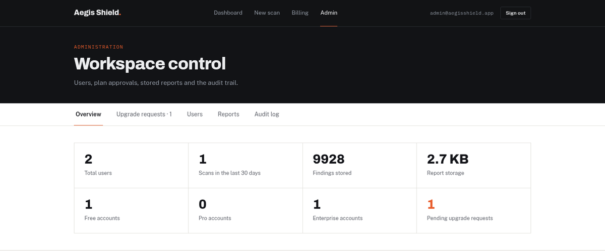

# Administrator guide

[← Back to README](../README.md)

## The administrator account

Aegis Shield has **exactly one** administrator.

- It is created only by `seed_admin.py`, from `ADMIN_EMAIL` and `ADMIN_PASSWORD` in `.env`. The
  launcher runs this for you on first start.
- Public registration always creates ordinary users. The role is hard-coded on the server and never
  read from the request.
- On startup the server refuses to boot if more than one admin exists, since that could only
  happen by editing the database directly.
- The administrator account can't be suspended, deleted or moved to another plan from the panel.

Sign in with the admin credentials and choose **Admin** in the navigation.

---

## Overview

| Metric | Source |
|---|---|
| Total users | All accounts, including the administrator |
| Scans in the last 30 days | Scan jobs created in the past 30 days |
| Findings stored | Every finding in the engine database |
| Report storage | Size of the engine's `output/` folder |
| Free / Pro / Enterprise accounts | Accounts per plan |
| Pending upgrade requests | Invoices waiting for a decision (highlighted when above zero) |

---

## Upgrade requests

Customers can't give themselves a paid plan. Every upgrade lands here.

| Column | Meaning |
|---|---|
| Requested | When the customer asked |
| Account | Customer email |
| Change | Current plan → requested plan |
| Invoice | Monthly price of the requested plan |

- **Approve** sets the customer's plan, resets their usage counter, marks the invoice **Paid** and
  writes `approve_upgrade` to the audit log.
- **Decline** marks the invoice **Declined**, leaves the plan unchanged and writes `reject_upgrade`.

> **Why approval is required.** Enterprise unlocks `deepscan`, which can launch sqlmap, hydra and
> wpscan from the server's IP address. Instant self-service upgrades would hand that to anyone who
> registers. See [Security](SECURITY.md#plan-escalation).

---

## Users

| Action | Effect | Audit entry |
|---|---|---|
| **Plan** dropdown | Sets the plan immediately, resets usage and records a *Manual* invoice | `set_tier` |
| **Reset password** | Sets a new password (at least 8 characters) | `reset_password` |
| **Suspend / Reinstate** | A suspended user can't sign in, and existing sessions stop on their next request | `suspend` / `unsuspend` |
| **Delete** | Removes the account with its subscription, invoices and scan jobs | `delete_user` |

Suspension is checked against the database on every request, not just at sign-in, so it takes
effect immediately.

---

## Reports

Lists every completed scan with its target, profile, owner, date and report size on disk. **Delete**
removes the report files (HTML, PDF, TXT) and the job record, and is logged as `delete_report`.

---

## Audit log

An ordered record of every administrative action: time, admin ID, action, affected user and
detail. Entries survive user deletion. The affected-user reference becomes empty, but the entry
stays.

| Action | Recorded when |
|---|---|
| `approve_upgrade` | An upgrade request was approved (`free -> pro`) |
| `reject_upgrade` | An upgrade request was declined |
| `set_tier` | A plan was set manually |
| `reset_password` | A user's password was reset |
| `suspend` / `unsuspend` | An account was suspended or reinstated |
| `delete_user` | An account was deleted (detail: email) |
| `delete_report` | A report was deleted (detail: job, target, profile) |
