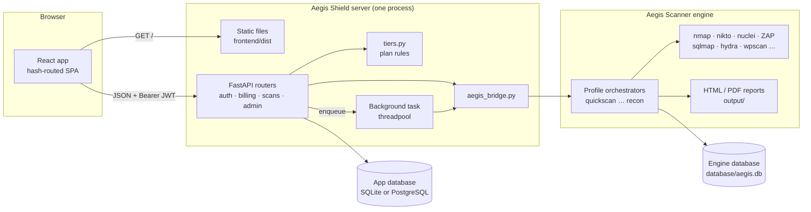
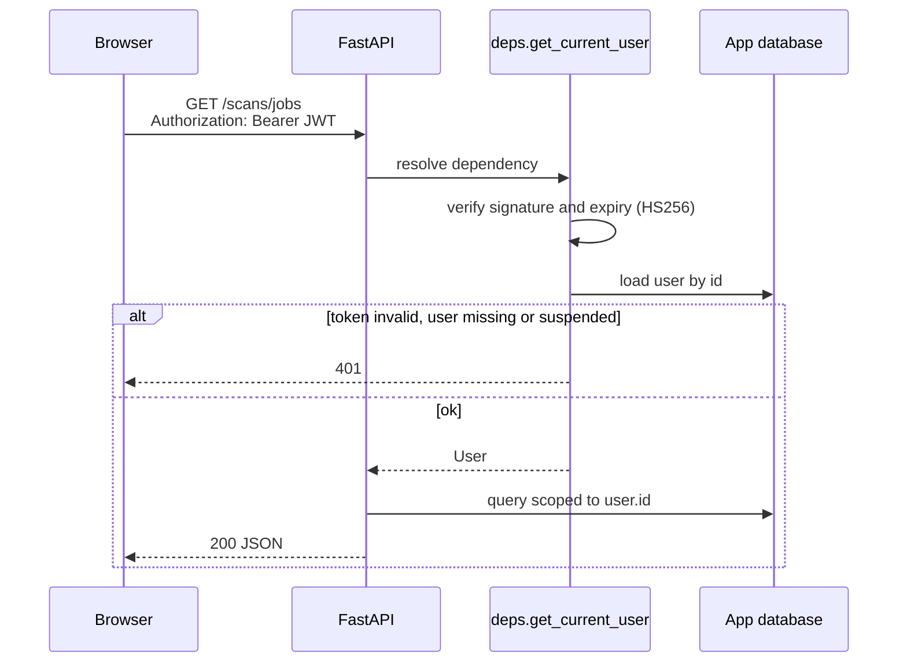
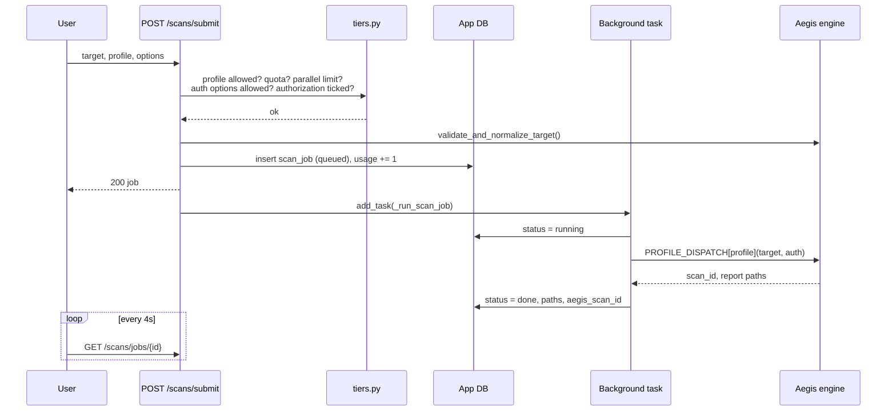
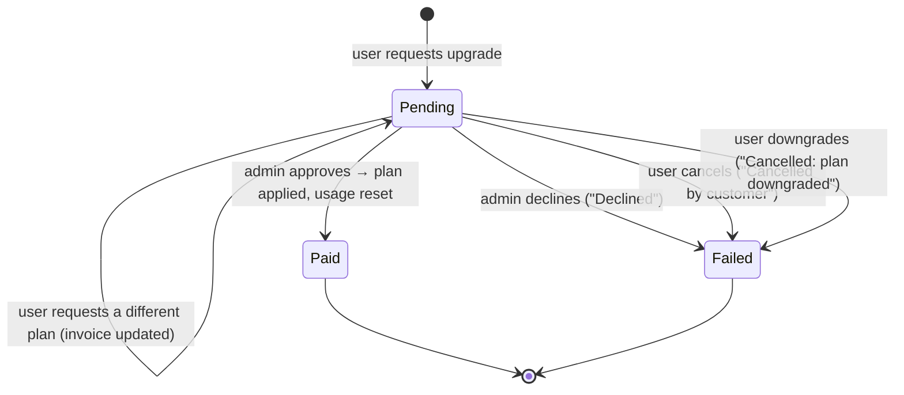
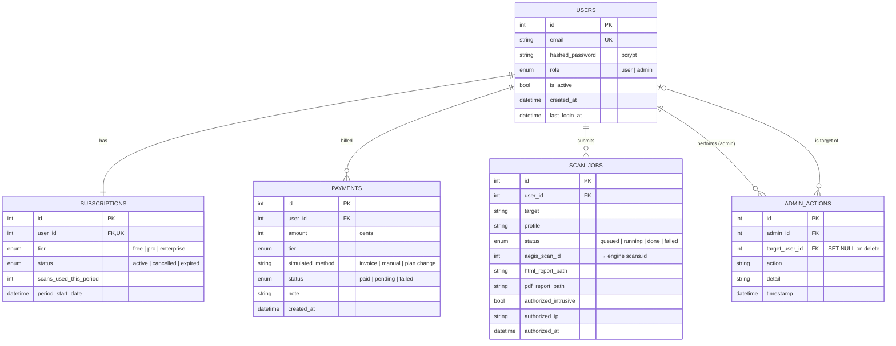

# Architecture

[← Back to README](../README.md)

- [System overview](#system-overview)
- [Request flow](#request-flow)
- [How a scan executes](#how-a-scan-executes)
- [Upgrade approval flow](#upgrade-approval-flow)
- [Data model](#data-model)
- [Backend modules](#backend-modules)
- [Frontend](#frontend)
- [Design decisions](#design-decisions)

---

## System overview

There are two databases on purpose:

| Database | Owner | Holds |
|---|---|---|
| **App database** (`DATABASE_URL`) | Aegis Shield | users, subscriptions, invoices, scan jobs, admin audit log |
| **Engine database** (`database/aegis.db`) | Aegis Scanner | scans, findings, enrichment data |

`scan_jobs.aegis_scan_id` links the two. The web platform never writes engine tables directly. It
only calls the engine's own functions, so the command-line scanner and the web platform always see
the same data.

---

## Request flow

Every authenticated request follows the same path:

- The user record is reloaded on **every** request, so suspension, deletion and role changes take
  effect immediately rather than when the token expires.
- Every resource query is filtered by `user_id`. Another user's job returns `404`, not `403`, so
  its existence isn't revealed.
- The frontend's axios interceptor attaches the token and sends the user back to sign-in on `401`.

---

## How a scan executes

- **Execution model.** FastAPI `BackgroundTasks` runs the synchronous engine call in Starlette's
  threadpool, so a long scan never blocks other requests.
- **Serialization.** `aegis_bridge` holds a process-wide lock around engine calls, because the
  engine's SQLite writer is not designed for concurrent writes from many threads.
- **Failure handling.** Any exception marks the job `failed` and stores the message. Individual
  tool failures inside a profile are recorded by the engine and don't fail the job.
- **Trade-off.** Jobs don't survive a server restart. A production deployment would swap
  `_run_scan_job` for a Celery or RQ task. The engine call is isolated in `aegis_bridge.py`, so
  nothing else would change.

---

## Upgrade approval flow

Upgrades are stored as rows in `payments` with `status = pending`. That keeps the invoice history
and the approval queue in one table, with no extra state to keep in sync. Downgrades skip the queue
and write a `paid` row with amount `0`.

---

## Data model

Deleting a user cascades to their subscription, invoices and scan jobs. Audit entries are kept,
with `target_user_id` set to `NULL`.

---

## Backend modules

| File | Responsibility |
|---|---|
| `app/main.py` | Creates the app. CORS plus the Private Network Access header, routers, startup checks (creates tables, engine `init_db`, refuses to boot with more than one admin), static frontend mount |
| `app/config.py` | Reads environment variables and `.env`. SQLite default. CORS list including the hosted frontend origin |
| `app/database.py` | SQLAlchemy engine and session. SQLite runs with `check_same_thread=False` for background tasks |
| `app/models.py` | ORM models above |
| `app/schemas.py` | Pydantic request and response models; they also validate input (email format, password length) |
| `app/security.py` | bcrypt hashing, JWT creation and verification |
| `app/deps.py` | `get_current_user`, `require_admin`, lazy 30-day usage reset |
| `app/tiers.py` | **The single source of truth** for plan capabilities, prices and ordering |
| `app/aegis_bridge.py` | The only module that imports the engine: target validation, profile dispatch, findings, diff |
| `app/routers/auth.py` | Register, sign in |
| `app/routers/billing.py` | Subscription, invoices, plan changes, cancelling a request |
| `app/routers/scans.py` | Profiles, submit (all gates), jobs, findings, reports, history, diff |
| `app/routers/admin.py` | Stats, users, upgrade approvals, reports, audit log |
| `alembic/` | PostgreSQL schema migrations |
| `seed_admin.py` | Creates the single admin account; refuses to create a second |

---

## Frontend

| Path | Responsibility |
|---|---|
| `src/main.tsx` | `HashRouter` and `AuthProvider` |
| `src/App.tsx` | Routes: public (`/`, `/login`, `/register`), signed-in (inside `Layout`), admin-only |
| `src/lib/api.ts` | axios client, runtime API base resolution, token interceptor, error messages |
| `src/lib/auth.tsx` | Session context kept in `localStorage` |
| `src/lib/plans.ts` | Plan names, prices and features shown in the UI (mirrors `tiers.py`) |
| `src/components/` | `Layout`, `PageHeader`, `AuthShell`, `PasswordInput`, `Labels`, `Brand`, `Footer` |
| `src/pages/` | One file per screen |

**Where the API is.** One production bundle works in every deployment, because `api.ts` decides at
runtime:

| Situation | API base |
|---|---|
| `VITE_API_BASE` set at build time | that value |
| Opened from `*.github.io` | `http://localhost:8000` |
| `npm run dev` | `http(s)://<same host>:8000` |
| Served by the backend (launcher, Docker) | same origin |

**Why hash routing.** Routes live after `#`, so static hosts like GitHub Pages and the backend's
static mount never need rewrite rules, and refreshing any page works.

---

## Design decisions

| Decision | Why | Cost |
|---|---|---|
| Import the engine as a library, not a subprocess | One source of truth for validation, profiles and findings; no output parsing | Engine and web app share a Python environment |
| `tiers.py` as the only place plan rules live | The UI only reflects rules; the server enforces them. A disabled button is never the control. | Frontend `plans.ts` copy must be kept in sync by hand |
| Upgrades need admin approval | Enterprise unlocks intrusive tooling; instant self-upgrade would give it to anyone | One manual step per upgrade |
| SQLite by default, PostgreSQL supported | A clone runs with no database server | SQLite suits one server, not a cluster |
| `BackgroundTasks` rather than a job queue | One process to run and explain | Jobs don't survive restarts; no horizontal scaling |
| Backend serves the built frontend | One port, one command, works across a LAN | Frontend changes need `npm run build` and the committed `dist/` |
| Lazy usage reset on read | No scheduler to run | The reset happens on the first request after the period ends, not exactly at midnight |
