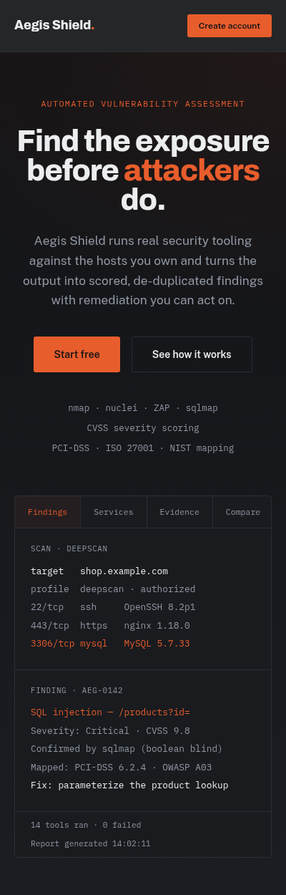

# Design system

[← Back to README](../README.md)

The interface follows an editorial, tool-like visual language: black, white and one orange accent,
hairline borders instead of shadows, and a mono typeface for anything technical. The rules below
are enforced by the Tailwind configuration itself. Large corner radii and shadows are removed from
the theme, so they can't creep back in.



---

## Principles

1. **One accent, used deliberately.** Orange marks the primary action or the one thing that needs
   attention in a view. Everything else uses neutrals.
2. **Separation by line and ground, never by shadow.** 1px borders and flat background changes
   create structure.
3. **Dark and light zones alternate.** Headers and title bands are dark; working content is light.
4. **Real content over decoration.** Bordered number badges and mono labels replace generic icons.
   The hero shows real scan output, not an illustration.
5. **Status by text and weight, not by colour-coding.** Severity and status are words in a hairline
   frame. There are no filled traffic-light badges.

---

## Colour tokens

Defined in `frontend/tailwind.config.js`.

### Dark zones (header, title bands, sign-in, call to action)

| Token | Hex | Use |
|---|---|---|
| `dark` | `#121316` | Background |
| `dark-surface` | `#191B1F` | Panels on dark |
| `dark-line` | `#2A2D33` | Hairline borders |
| `on-dark` | `#ECEDEF` | Primary text |
| `dim-dark` | `#9198A3` | Secondary text |

### Light zones (content, tables, stats, footer)

| Token | Hex | Use |
|---|---|---|
| `light` | `#FFFFFF` | Background |
| `light-alt` | `#F5F5F3` | Footer, table headers, callouts |
| `light-line` | `#E2E1DC` | Hairline borders and grid gaps |
| `ink` | `#14151A` | Primary text |
| `dim` | `#63666E` | Secondary text |

### Accent

| Token | Hex | Use |
|---|---|---|
| `brand` | `#E85D2C` | Primary buttons, active nav, eyebrow labels, critical severity |
| `brand-dim` | `#B84A22` | Button hover, light-zone eyebrows, high severity, failed status |

**The only gradient** in the product is the landing hero (`.hero-atmosphere`): `#121316` to
`#1B1D22` top to bottom, with a 7%-opacity orange glow from the top-right corner.

---

## Typography

| Role | Family | Weights | Notes |
|---|---|---|---|
| Display | Archivo | 600, 700, 800 | Headlines; tracking −0.02 to −0.025em; hero `clamp(2.6rem, 6vw, 5rem)` at line-height 0.98 |
| Body | Public Sans | 400, 500, 600 | Default `font-sans` |
| Technical | IBM Plex Mono | 400, 500, 600 | Eyebrows, labels, targets, ports, CVEs, timestamps |

Loaded from Google Fonts in `index.html`, with system fallbacks.

---

## Components

Defined as Tailwind component classes in `frontend/src/index.css`.

| Class | Description |
|---|---|
| `.btn-primary` | Flat `brand` fill with dark text; hover shifts to `brand-dim`; 1px press offset; no shadow or glow |
| `.btn-outline` / `.btn-outline-dark` | 1px line border; text and border turn `brand` on hover; no fill animation |
| `.btn-sm` | Compact size modifier |
| `.eyebrow` / `.eyebrow-light` | Uppercase mono label, 0.1em tracking, in `brand` or `brand-dim` |
| `.input` / `.input-dark` | 3px radius, hairline border, border darkens on focus |
| `.panel`, `.panel-head`, `.panel-title` | Bordered content block with a header row |
| `.data-table` | Mono uppercase column headers on `light-alt`, hairline row separators |
| `.tag` | Mono uppercase label in a hairline frame, used for statuses and severities |
| `.num-badge` | 36px bordered square with a mono number, used instead of icons |

Radius scale (replaces Tailwind's default): `none 0` · `sm 2px` · `DEFAULT 3px` · `md 4px`.
Shadow scale: `none` only.

### Grid-with-hairlines pattern

Card grids get their dividing lines from the container background showing through a 1px gap, not
from borders on each card:

```html
<div class="grid grid-cols-4 gap-px border border-light-line bg-light-line">
  <div class="bg-light p-6">…</div>
</div>
```

### Severity and status

| Label | Treatment |
|---|---|
| critical | `brand` text and border, 5% `brand` wash |
| high | `brand-dim` text and border |
| medium | `ink` text and border |
| low / info | `dim` text, `light-line` border |
| running | `ink` frame with a small pulsing `brand` square |
| complete | `ink` frame |
| failed | `brand-dim` frame |

---

## Page anatomy

```text
┌───────────────────────────────────────────────┐
│ Sticky header (dark, 92% opaque, 6px blur)    │  the only translucent surface
├───────────────────────────────────────────────┤
│ PageHeader — mono eyebrow, Archivo title      │  dark zone
├───────────────────────────────────────────────┤
│ Stats bar — big numbers, hairline dividers    │  light zone
│ Panels / tables / card grids                  │
├───────────────────────────────────────────────┤
│ Footer (light-alt, hairline top border)       │
└───────────────────────────────────────────────┘
```

## Accessibility

- Text contrast: `ink` on `light` is about 18:1, `on-dark` on `dark` about 16:1, and dark text on
  `brand` about 5:1.
- Visible 2px orange focus ring on every interactive element (`:focus-visible`).
- Password fields have a **Show/Hide** toggle with `aria-pressed` and a descriptive `aria-label`.
- Tabs use `role="tablist"`/`role="tab"` with `aria-selected`; form errors use `role="alert"`.
- Layouts collapse to a single column at phone width; wide tables scroll horizontally inside their panel.
