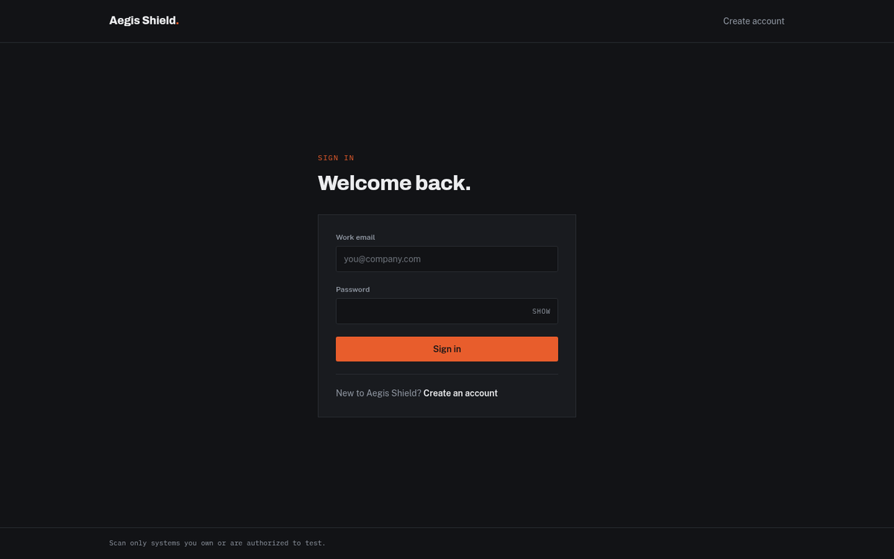
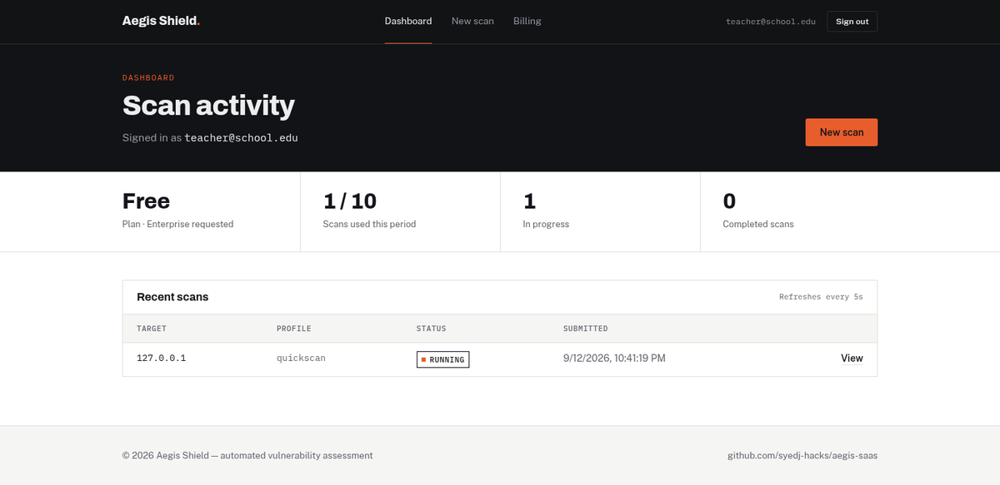
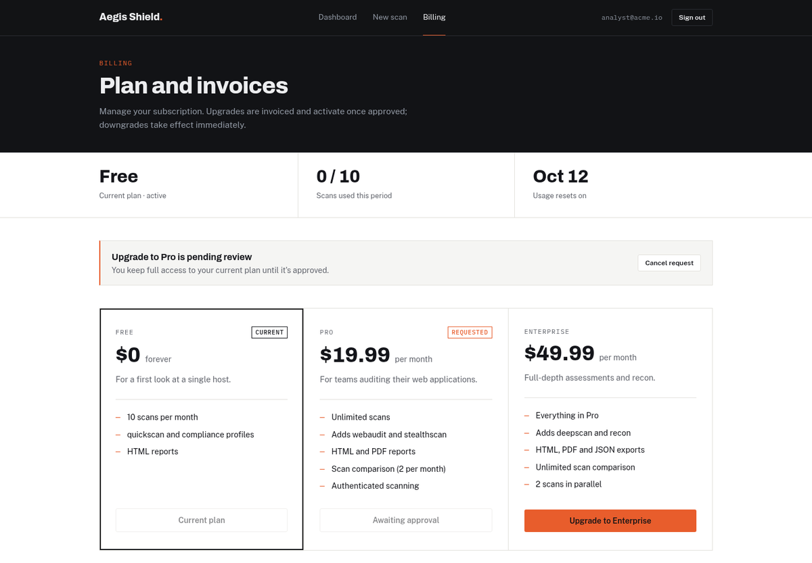

# User guide

[← Back to README](../README.md)

- [Creating an account](#creating-an-account)
- [The dashboard](#the-dashboard)
- [Running a scan](#running-a-scan)
- [Reading results](#reading-results)
- [Exporting reports](#exporting-reports)
- [Comparing scans](#comparing-scans)
- [Plans and billing](#plans-and-billing)

---

## Creating an account

1. Open the address printed by the launcher (for example `http://localhost:8000`) and choose
   **Create account**.
2. Enter your email and a password of at least 8 characters, twice. Use **Show** to check what
   you typed.
3. You are signed in straight away on the **Free** plan.

Sessions last 24 hours. After that you are sent back to the sign-in page.

---

## The dashboard

The stats bar shows your plan, scans used this period, scans in progress and completed scans. The
table lists every scan you submitted, newest first, and refreshes every five seconds.

| Status | Meaning |
|---|---|
| `queued` | Accepted, waiting to start |
| `running` | Tools are executing against the target |
| `complete` | Finished; findings and reports are ready |
| `failed` | Stopped with an error, shown under the status |

---

## Running a scan

Open **New scan**.

1. **Target.** Enter one hostname or IP address, for example `app.example.com` or `10.0.0.5`.
   URLs are normalized to their host. CIDR ranges and malformed hosts are rejected.
2. **Profile.** Choose one of the six profiles. Profiles your plan doesn't include show the plan
   they need and can't be selected.

| Profile | Plan | What it does |
|---|---|---|
| `quickscan` | Free | Top-port nmap sweep plus whatweb/nuclei on the first web port. A fast first pass. |
| `compliance` | Free | TLS and security-header checks mapped to PCI-DSS, ISO 27001 and NIST 800-53. |
| `stealthscan` | Pro | About 20 ports at polite timing with a single fingerprint, for a minimal footprint. |
| `webaudit` | Pro | Web application focus: headers, nikto, gobuster/dirb, whatweb, sslyze, XSS checks. |
| `deepscan` | Enterprise | Full assessment: discovery, service detection, all web tools, ZAP, plus wpscan/sqlmap/hydra/enum4linux when their trigger conditions are met. |
| `recon` | Enterprise | Passive attack-surface mapping (certificate transparency, subdomains, OSINT, cloud buckets). Never sends a packet to the target. |

3. **Options.** Pro and Enterprise can add an **auth header** (for example
   `Authorization: Bearer …`) or an **auth cookie** so web tools scan behind a login.
4. **Authorization.** `deepscan` can run intrusive tools, so you must tick the confirmation that you
   own or are authorized to test the target. The confirmation is stored with a timestamp and your IP
   address.
5. Select **Start scan**. You are taken to the results page, which updates while the scan runs.

### Limits

| | Free | Pro | Enterprise |
|---|---|---|---|
| Scans per 30-day period | 10 | Unlimited | Unlimited |
| Scans running at once | 1 | 1 | 2 |

The period starts when your account was created and rolls over every 30 days.

---

## Reading results

The results page opens with a count of findings per severity, followed by the findings table.

| Column | Meaning |
|---|---|
| **Severity** | `critical`, `high`, `medium`, `low` or `info` |
| **Port** | Affected port, where the finding is tied to one |
| **Type** | The kind of finding (for example missing header, outdated service, injection) |
| **Description** | What was found. When available, a **Fix** line underneath gives the remediation. |
| **CVE** | A matched CVE identifier, where one applies |

Use **All severities** to filter the table and the sort button to toggle between severity order and
the order the tools reported findings in.

---

## Exporting reports

Export buttons appear once a scan is complete. Each one downloads a file.

| Format | Plan | Contents |
|---|---|---|
| `HTML` | All | The full report as a self-contained web page |
| `PDF` | Pro, Enterprise | The same report as a downloadable document |
| `JSON` | Enterprise | Machine-readable findings for your own tooling |

The engine keeps the five most recent reports for each target and profile. Older reports are pruned
automatically.

---

## Comparing scans

On Pro and Enterprise, a completed scan that has earlier scans
of the same target shows **Compare with a previous scan**. The result has four groups:

| Group | Meaning |
|---|---|
| **New** | Present now, absent before |
| **Fixed · confirmed** | Gone, *and* the tool that found it ran again and no longer reports it |
| **Unverified** | Gone, but the tool that would re-confirm it didn't run this time, so it may still be there |
| **Severity changed** | Still present with a different severity |

The **Unverified** group is deliberate. A finding only counts as fixed when there is evidence that
it's fixed.

---

## Plans and billing

The **Billing** page shows your plan, usage, when usage resets, the plan options and your invoice
history.

**Upgrading**
1. Select **Upgrade to Pro** or **Upgrade to Enterprise**.
2. An invoice is created with status **Pending review**, and a banner confirms the request.
3. You keep your current plan until an administrator approves the invoice. The new plan then
   applies immediately and your usage counter resets.
4. **Cancel request** withdraws a pending upgrade. Requesting a different plan while one is pending
   replaces it.

**Downgrading.** Select **Switch to …** on a lower plan and confirm. The change is immediate, and
features above the new plan stop straight away.

**Invoice statuses**

| Status | Meaning |
|---|---|
| Pending review | Waiting for an administrator |
| Paid | Approved or applied |
| Declined | Rejected by an administrator |
| Cancelled | Withdrawn by you, or replaced by a downgrade |
